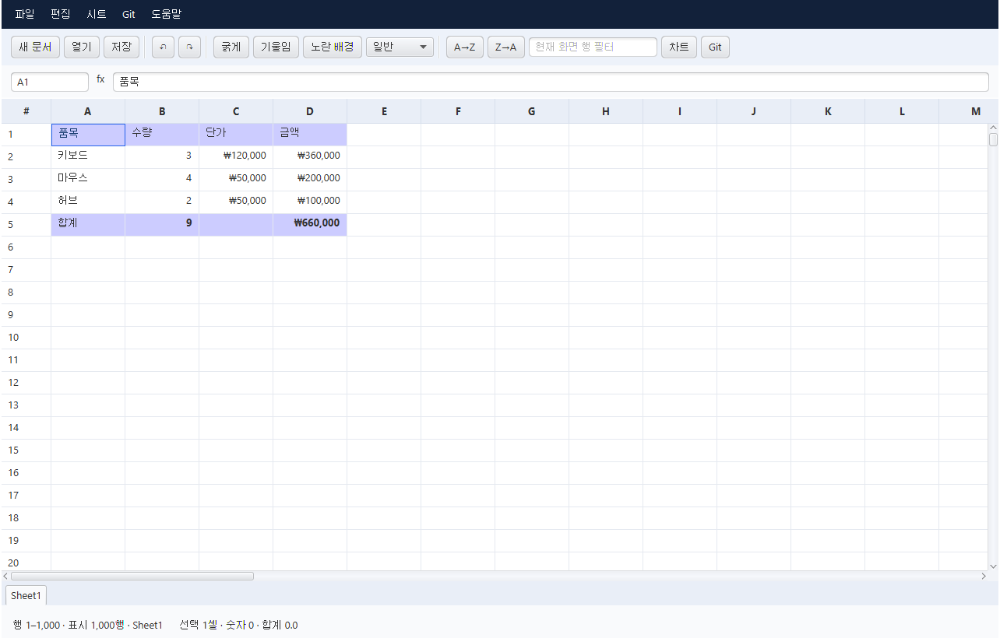

# Git Sheet

JDK 25와 JavaFX로 만든 **Git 친화적인 데스크톱 스프레드시트**입니다. 셀 값·수식·기본 서식을 줄 단위 텍스트로 저장해서 일반 Git diff와 커밋 기록으로 문서 변경을 확인합니다.

현재 버전은 **0.2 개발 버전**입니다. Microsoft Excel의 대부분 기능을 완성한 제품이 아니며, 아래 지원 범위와 제한을 먼저 확인하세요.



## 빠른 시작

필수: **JDK 25**, Git. Maven은 Wrapper가 내려받습니다. 첫 실행에는 인터넷이 필요합니다.

Windows PowerShell:

```powershell
.\mvnw.cmd clean verify
.\mvnw.cmd javafx:run
```

macOS / Linux:

```sh
./mvnw clean verify
./mvnw javafx:run
```

Windows에서 `run.cmd`를 실행해도 됩니다. `JAVA_HOME`은 JDK 25 설치 폴더를 가리켜야 합니다. Maven 3.9의 Guice가 JDK 25에서 출력하는 `sun.misc.Unsafe` 경고는 앱 코드에서 발생하는 경고가 아닙니다.

### IntelliJ IDEA

1. 이 폴더의 `pom.xml`을 **프로젝트로 열기**합니다.
2. Project SDK와 Maven Runner JRE를 **JDK 25**로 설정합니다.
3. Maven 프로젝트를 동기화합니다.
4. Maven 도구 창 → Plugins → javafx → `javafx:run`을 실행합니다. 공유 실행 설정 `Git Sheet`도 포함되어 있습니다.

## 구현된 기능

| 기능 | 지원 범위 |
| --- | --- |
| 셀 편집 | 텍스트·숫자·불리언·수식, 더블 클릭/F2 편집, 수식 입력줄 |
| 수식 | Apache POI가 지원하는 SUM, AVERAGE, IF 등, 셀·범위·다른 시트 참조, 변경 시 캐시 무효화 |
| 시트 | 추가·이름 변경·삭제, 하단 시트 탭 |
| 편집 이력 | 트랜잭션 단위 실행 취소/다시 실행, 오류 시 전체 작업 복구 |
| 클립보드 | 직사각형 TSV 복사·붙여넣기, 탭·따옴표·줄바꿈 처리 |
| 채우기 | 아래로 Ctrl+D / 오른쪽 Ctrl+R, 수식의 상대·절대·혼합 참조 조정, 값 타입과 서식 복사 |
| 찾기/바꾸기 | 현재 시트 텍스트 모두 바꾸기, 대소문자 구분, 수식 포함 선택, 실패 시 복구 |
| 기본 서식 | 굵게·기울임·배경, 숫자·통화·백분율·날짜, 정렬, 테두리, 글꼴 크기, 저장되는 열 너비 |
| 정렬·필터 | 지정 범위의 실제 데이터 정렬(헤더 제외, 최대 100만 셀), **현재 화면 1,000행**을 대상으로 하는 보기 정렬·텍스트 필터. 원본 셀 위치는 바꾸지 않음 |
| 찾기·이동 | 현재 시트의 값/수식 찾기, 주소 입력 이동, 1,000행 단위 이동 |
| 차트 | 선택 영역의 첫 열(이름)과 마지막 열(수치)로 막대 차트 미리보기, 최대 200행 |
| 파일 | `.gsheet` 저장/열기, `.xlsx` 가져오기/내보내기, UTF-8 CSV, 저장 경로를 4초 동안 보여주는 알림 |
| Git | 문서 diff·기록·커밋, GitHub/GitLab/Gitea/자체 서버 선택, 연결 확인·push·fetch |

앱은 예제 구매 목록으로 시작합니다. **파일 → 새 문서**로 빈 문서를 만들 수 있습니다.

## 행·열 삽입과 삭제

연속된 셀을 선택한 뒤 **시트 → 선택 행 위에 삽입 / 선택 열 왼쪽에 삽입 / 선택 행·열 전체 삭제**를 사용합니다. 선택한 행·열 개수만큼 시트 전체에 적용되며, 삭제는 선택 셀의 내용만 지우는 작업과 다릅니다. `Ctrl+Z` 한 번으로 복구할 수 있습니다. 정렬·필터는 먼저 해제하세요.

일반 셀·범위·다른 시트·절대 참조와 이름 정의를 갱신하고 삭제된 참조는 `#REF!`로 바꿉니다. 셀 서식, 행 높이, 열 너비·숨김, 병합 범위와 틀 고정 위치도 이동합니다. 마지막 행·열의 데이터나 서식이 밀려 사라질 때는 삽입을 거절합니다. 삽입되는 행·열은 기본 서식을 사용합니다. Excel 표 또는 배열 수식이 있는 경우 구조 편집을 제한합니다. 고급 객체(그림·유효성 검사·외부 참조 등)의 위치 및 참조 갱신은 보장하지 않습니다.

## 잘라내기와 셀 이동

같은 시트에서 직사각형 셀 범위를 선택하고 **Ctrl+X → 대상 셀 선택 → Ctrl+V**로 이동합니다. 붙여넣기에 성공할 때 원본을 비우며, 겹치는 범위로의 이동도 지원합니다. 셀 타입과 서식을 보존하고 해당 셀을 참조하는 일반 수식·다른 시트 수식·이름 정의를 갱신합니다. 이동한 수식의 범위 밖 참조는 그대로 유지합니다. Ctrl+Z 한 번으로 이동과 참조 변경을 함께 복구합니다.

Esc, 문서 편집 또는 undo/redo는 이동 예약을 취소합니다(복사 내용은 유지). 시트 사이의 이동, 수식 범위 중 일부만 이동, 여러 시트를 묶는 3D 참조, 병합 셀·배열 수식 및 고급 객체가 포함된 문서는 아직 이동을 제한합니다. 이 경우 오류를 안내하고 원본을 보존합니다. 잘라내기에는 값만/서식만 붙여넣기를 적용할 수 없습니다.

## 실제 데이터 정렬

**데이터 → 범위 데이터 정렬**에서 `A1:D5000`처럼 범위와 `B` 같은 기준 열을 지정합니다. 첫 행을 제목으로 제외하거나 내림차순을 선택할 수 있습니다. 화면 밖 행까지 지정한 직사각형의 셀을 행 단위로 정렬하며, 최대 100만 셀을 처리합니다. 도구막대의 **화면 A→Z / 화면 Z→A**는 기존 화면 표시 순서만 바꿉니다.

숫자는 숫자 크기로, 문자열은 대소문자를 구분하지 않고 비교합니다. 오름차순 타입 순서는 숫자 → 문자열 → 불리언 → 오류이며, 빈 값은 양방향 모두 마지막입니다. 같은 값의 순서는 유지합니다. 수식 기준 열은 정렬 전 계산값으로 비교합니다. 셀 타입·서식과 행 안의 데이터를 함께 옮기고, 이동하는 수식의 상대 참조를 새 행에 맞게 조정합니다. **범위 밖 수식과 이름 정의는 기존 주소를 계속 참조**하며 행 높이·숨김 상태는 이동하지 않습니다. Ctrl+Z 한 번으로 복구할 수 있습니다.

병합/배열 수식/메모/하이퍼링크 셀, 보호 시트 및 표·조건부 서식·유효성 검사·그림이 있는 시트는 아직 데이터 정렬을 제한합니다. 미지원 계산이나 참조 변환 실패 시 원본을 유지합니다. 정렬은 현재 동기식이므로 큰 범위는 UI를 잠시 멈출 수 있습니다.

## 열별 필터

**데이터 → 열별 필터**에서 주소 범위와 최대 3개 조건을 지정합니다. 선택한 조건을 모두 만족하는 행만 표시합니다. 문자 포함/일치(대소문자 무시), 빈 값/빈 값 아님, 숫자 비교를 지원하며 숫자처럼 보이는 문자열은 숫자 조건에 포함하지 않습니다. 수식은 계산 결과로 비교하고 텍스트 비교는 통화·날짜 표시 서식이 아닌 기본 값으로 수행합니다.

최대 10만 행을 검사하고 결과를 원래 행 번호로 1,000행씩 표시합니다. **시트 → 이전/다음 1,000행**으로 결과 페이지를 이동합니다. 헤더는 각 페이지에 유지하며, 편집과 실행 취소 후 조건을 다시 계산합니다. **데이터 → 열별 필터 해제**, 시트 전환 또는 주소 이동으로 해제합니다. 필터 설정은 파일에 저장하지 않고 원본 값·주소·수식을 변경하지 않습니다. 열별 필터 중에는 기존 화면 검색을 비활성화하며 붙여넣기/채우기/행·열 구조 편집 전에 필터를 해제해야 합니다. 검사와 재계산은 동기식입니다.

## Git으로 문서 관리하기

1. 개인 문서용 폴더를 만들고 `.gsheet`로 저장합니다. 이 공개 소스 저장소와 개인 문서 저장소는 별도로 운영하세요.
2. **Git → 서버 연결 / 동기화**에서 GitHub, GitLab, Gitea, 기타 Git 서버 또는 로컬 Git만 사용을 선택합니다. 기존 `origin`이 있으면 주소를 제안합니다.
3. 서버에서 미리 만든 저장소의 **Clone URL**을 입력하고 설정을 저장합니다. HTTPS와 SSH, GitLab 하위 그룹 및 자체 서버 포트를 지원합니다. 작성자 이름·이메일도 이 화면에서 해당 저장소에만 설정할 수 있습니다.
4. **Git → 문서 저장 후 커밋**에서 메시지를 입력합니다.
5. **Git → 문서 변경 내용 / 기록**으로 비교합니다. 미저장 변경은 먼저 저장합니다. 첫 커밋 이전에는 새 문서 미리보기를 표시하며 변경 없는 재커밋은 오류가 아닙니다.
6. 서버 연결 화면의 **연결 확인**, **업로드 (push)**, **원격 기록 가져오기 (fetch)**를 사용합니다. 연결 확인은 조회 권한만 검사하며 쓰기 권한은 업로드 시 확인합니다.

```sh
git config --global user.name "Your Name"
git config --global user.email "you@example.com"
```

다른 파일의 staged 변경은 문서 커밋에 포함하지 않습니다. 서버별 연결은 `gitsheet-github`, `gitsheet-gitlab`, `gitsheet-gitea` 같은 별도 remote로 저장되어 기존 `origin`을 교체하지 않습니다. 설정은 `.git/config`에 저장되며 문서 파일에 들어가지 않습니다.

**Push는 현재 브랜치의 모든 커밋을 전송**하므로 앱에서 대상 주소와 저장소 폴더를 확인합니다. 강제 push는 하지 않습니다. Fetch는 원격 기록만 가져오고 열린 문서와 로컬 파일을 바꾸지 않습니다. 브랜치 전환·pull·merge·충돌 해결은 Git CLI/IntelliJ에서 처리합니다. 기존 기록이 있는 서버로 새 로컬 저장소를 push하면 거절될 수 있으므로 먼저 서버 저장소를 clone하여 사용하는 것이 편합니다.

인증은 각 서버에 맞게 **Git 자격 증명 관리자 또는 SSH 키**를 미리 설정하세요. 앱에 비밀번호/토큰을 입력하거나 저장하지 않습니다. 인증 만료 시 복구 방법을 안내하며 네트워크 작업은 60초 제한을 둡니다. 외부 GitHub/GitLab/Gitea 계정의 실제 인증 조합 전체를 검증한 것은 아닙니다. 테스트는 각 서비스 설정을 독립적인 로컬 bare 저장소에 연결하여 실제 push/fetch를 검증합니다.

`.gsheet`는 UTF-8 JSON Lines입니다. 한 셀의 변경은 해당 셀 레코드 한 줄에 나타나고 계산 결과 캐시는 저장되지 않습니다. 동일 셀을 두 브랜치에서 수정하면 일반 Git 충돌이 날 수 있으며, 충돌 표시를 해결해야 다시 열 수 있습니다.

## Excel 호환성 및 알려진 제한

- **VBA/매크로, 피벗 테이블 편집, Power Query, Power Pivot, 실시간 공동 편집, Solver, 전체 Excel 함수 집합, 동적 배열은 미지원**입니다.
- `.gsheet`는 값·수식·일부 기본 서식·열 너비·행 높이·행/열 숨김·병합/틀 고정 메타데이터만 저장합니다. 그림·고급 차트·이름 정의·테이블·조건부 서식·유효성 검사·댓글·하이퍼링크·인쇄 설정 등은 보존하지 않습니다. 테마 색상, 글꼴의 고급 속성 및 테두리 색도 완전 보존하지 않습니다.
- 이름 정의/외부 연결/구조화 참조에 의존한 수식은 `.gsheet` 변환 후 계산되지 않을 수 있습니다. **원본 Excel 파일을 보관하세요.** 가져오기는 원본을 덮어쓰지 않습니다.
- 병합·틀 고정 메타데이터는 왕복 저장하지만 화면에서는 병합/고정 렌더링을 하지 않습니다. 열 너비 드래그 변경은 화면에만 적용됩니다.
- 수식 미지원 오류는 `#UNSUPPORTED!`로 표시합니다. 일반 Excel 계산 오류(`#DIV/0!` 등)는 그대로 표시합니다.
- 같은 문서에서 복사한 셀은 타입·서식과 상대 수식 참조를 보존합니다. **편집 → 값만 붙여넣기 / 서식만 붙여넣기**도 지원합니다. 값 붙여넣기는 복사 당시 계산 결과를 사용하고 대상 서식을 유지합니다. 다른 프로그램이나 새 문서에서 가져온 클립보드는 텍스트로 처리하며, 외부 텍스트의 값만 붙여넣기는 수식을 실행하지 않고 문자열로 넣습니다. 문서 간 서식 복사는 아직 미지원입니다. **아래로/오른쪽 채우기**는 Excel처럼 상대 참조를 이동하고 절대 참조를 보존합니다. 채우기는 정렬/필터 없이 연속된 범위에서 사용하세요. 문자열을 다시 편집할 때는 타입 보존을 위해 입력란 앞에 작은따옴표가 표시됩니다. 선행 0이 있는 값은 문자열이며, 앞에 `'`를 붙이면 강제로 텍스트 입력이 됩니다.
- CSV 가져오기는 수식 실행을 막기 위해 모든 필드를 텍스트로 읽습니다. CSV 내보내기는 표시값만 기록합니다. 다른 프로그램에서 CSV를 열 때 그 프로그램이 수식처럼 해석할 수 있는 텍스트가 포함될 수 있습니다.
- 그리드는 **1,000행 × 52열 창**을 가상 렌더링하고 주소 이동으로 Excel 좌표 범위에 접근합니다. 워크북 자체와 실행 취소 스냅샷은 메모리에 있으므로 대용량 파일의 성능 보장은 아닙니다.
- 내부 클립보드는 선택 범위의 값·필요한 서식·수식 참조 정보만 보관하며 문서 전체를 복제하지 않습니다. 값만 붙여넣기에 사용할 수식 결과는 복사 시점에 계산합니다. 복잡한 수식의 복사 계산은 UI를 일시 정지시킬 수 있으며, 미지원 수식의 값 붙여넣기는 오류로 안내합니다.
- 실행 취소는 최대 30단계, 각 방향 합계 32MiB를 목표로 제한합니다. 가장 최근 스냅샷 하나는 한도를 넘더라도 보존합니다. 큰 워크북 저장/가져오기/수식 계산은 UI를 일시 정지시킬 수 있습니다.
- 차트는 일회성 미리보기이며 파일에 저장되지 않습니다. 날짜 입력 자동 인식, 드래그 채우기 핸들, 인쇄/PDF, XLS 바이너리 형식은 아직 지원하지 않습니다.

## 기술 선택

- JDK 25: records, switch expressions, unnamed variables, virtual threads. Preview 기능 없음.
- JavaFX 25.0.4: JDK 25에서 동작하는 25 계열 안정 릴리스, 가상화 TableView.
- Apache POI 5.5.1: XLSX 모델·수식·서식.
- Gson 2.13.2 / Commons CSV 1.14.1: 텍스트 저장과 CSV 파싱.
- 문서 저장은 같은 디렉터리 임시 파일을 사용하고 가능한 파일시스템에서는 원자적으로 교체합니다.
- Git I/O는 가상 스레드에서 실행합니다. 셸 문자열을 조합하지 않고 인자 배열로 실행합니다.
- [OpenJFX Maven 가이드](https://openjfx.io/openjfx-docs/#maven), [JavaFX 25 요구사항](https://openjfx.io/highlights/25/), [Apache POI](https://poi.apache.org/).

## 검증

```powershell
.\mvnw.cmd clean verify
.\mvnw.cmd javafx:run '-Djavafx.args=--smoke-test'
```

`mvnw test`는 수식, 저장 형식, Git 초기 상태·파일명·원격 전송·충돌 보호 및 채우기를 검증합니다. UI smoke test는 실제 셀 편집, 수식 갱신, 실행 취소/다시 실행, 필터, 주소 이동, 저장 알림과 자동 닫힘, Gitea 선택 및 설정 저장까지 확인합니다. Linux CI에서는 Xvfb로 실행합니다. Microsoft Excel 애플리케이션 자체와의 수동 상호운용 테스트는 수행하지 않았습니다.

[설계 및 확장 계획](docs/ARCHITECTURE.md)을 참고하세요.

개발 재개 시에는 [진행 기록](docs/PROGRESS.md)의 완료 항목과 다음 작업을 먼저 확인하세요.
